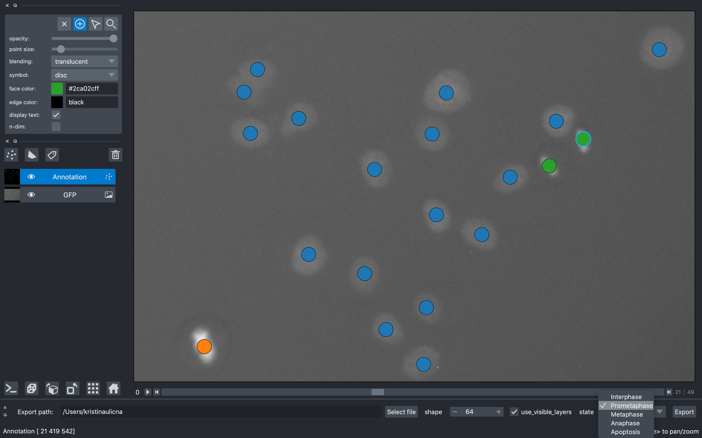

# Convolutional neural networks 🖥️ for classifying chromatin morphology 🧬 in live cell imaging 🔬
<br/>



Welcome to our [CNN Annotator repository](https://github.com/lowe-lab-ucl/cnn-annotator "CNN Annotator repository || Lowe Lab UCL") where you can find our recent *Methods in Molecular Biology (MiMB) protocol* on how to use a convolutional neural network (CNN) to classify time-lapse microscopy single-cell images patches according to live-cell chromatin morphology.

**Wondering what such pipeline could be used for?** Check out our recent publications where we made use of CNNs for classifying cells in live-cell imaging:
- [Ulicna *et al.*, bioRxiv, 2020](https://www.biorxiv.org/content/10.1101/2020.09.10.276980v1.full "Automated deep lineage tree analysis using a Bayesian single cell tracking approach") - Automated deep lineage tree analysis using a Bayesian single cell tracking approach
- [Bove *et al.*, MBoC, 2017](https://www.molbiolcell.org/doi/10.1091/mbc.E17-06-0368?url_ver=Z39.88-2003&rfr_id=ori:rid:crossref.org&rfr_dat=cr_pub%20%200pubmed "Local cellular neighbourhood controls proliferation in cell competition") - Local cellular neighbourhood controls proliferation in cell competition


### How to navigate this repository

We provide a detailed walk-through for annotating live-cell microscopy images and training CNN model to infer classification labels on previously unseen images. Here is an overview of the entire process:


For more detailed instructions on how to annotate your microscopy data, train the CNN classifier and infer labels on previously unseen images, please refer to [this step-wise manual](/notebooks/README.md "Protocol Methods").

Please use these links to proceed with the training and inference of your CNN models in the **Google Colab** environment:


| Notebook | Description | Link |
| --- | --- | --- |
| *Training* | Train the CNN using annotated image patches | [](https://colab.research.google.com/github/lowe-lab-ucl/cnn-annotator/blob/main/notebooks/C_CNN_Training_and_Validation.ipynb) |
| *Inference* | Use the trained CNN to perform predictions and clustering | [](https://colab.research.google.com/github/lowe-lab-ucl/cnn-annotator/blob/main/notebooks/D_CNN_Inference_and_Embedding.ipynb) |


### Installation Instructions

Clone the repo locally and create a clean `conda` environment with all needed packages to run notebooks A & B on your local machine using the following commands:

```sh
git clone https://github.com/lowe-lab-ucl/cnn-annotator.git
cd cnn-annotator
conda env create -f ./environment.yml
conda activate cnn-annotator
```
---

*Happy coding!* <br/>
... **Your [CellX](http://lowe.cs.ucl.ac.uk/cellx.html "Lowe Lab UCL") team**
