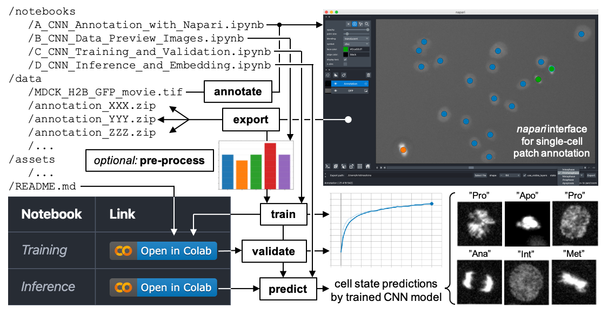

# Notebooks & Repository Structure

## Abstract

Chromatin is a highly organised structure and the changes in its condensation level reflect many cellular processes, including cell division and cell death. Recently, advances in machine learning have enabled researchers to automatically classify chromatin morphology in fluorescence microscopy images.  In this protocol, we develop user friendly tools to perform this task. We provide an open-source annotation tool, and a cloud-based computational framework to train and utilise a convolutional neural network to automatically classify chromatin morphology. Using cloud compute enables users without significant resources or computational experience to use a machine learning approach to analyse their own microscopy data.

### Annotating CNN training images using *Napari*:

1. At the terminal make sure you are in the `cnn-annotator` directory and type `jupyter notebook`, you will then be redirected to a jupyter notebook environment in your default browser.
2. Open `A_CNN_Annotation_with_Napari.ipynb` by clicking on the filename. A separate window will open.
3. In the notebook, modify the file path to your image data (*default:* `../data/MDCK_H2B_GFP_movie.tif`).
If you are using your own classification labels, create those labels in the notebook using the `CellState` structure.
4. Run the notebook and a separate Napari instance with a GUI window will pop up.
5. Inside Napari, select a label corresponding to a particular chromatin morphology and annotate the image data by placing a small marker at the centre of each cell with the appropriate morphology.
6. Aim to annotate a few hundred examples of each state that you wish to classify.
7. Export the data using the `export` button. This writes a single zip file containing all of the image patches as well as the locations in T(Z)YX and ground truth labels. This zip file can be used as a source of training data for the CNN.
8. You can close the Napari instance when done. Repeat steps 5-8 to create additional annotation zip files for validation and future inference on new images.
9. *(Optional)* If you wish to assess the class balance and visualise your annotations, return to the jupyter notebook interface, then open and run `B_CNN_Data_Preview_Images.ipynb`.

### Training the chromatin morphology CNN classifier:

1. In the github repository, click on the `Open in Colab` notebook for Training.
2. Follow the instructions in the notebook, and upload the training and validation datasets to the Colab `/content/train/` and `/content/validation/` subfolders.
Make sure that you set aside some data for validation.
3. Set the hyperparameters required for training.
4. Run the Colab notebook to train the model.
5. Monitor the training performance using TensorBoard.
6. Save out and download the trained model (`model.h5`) for future use.

### Evaluating the CNN performance & predictions:

1. Calculate the confusion matrix using the notebook.
2. Calculate other performance metrics, including the F1-score, precision and recall.
3. Using the CNN for chromatin morphology classification on unseen data.
4. Once the CNN has been successfully trained, the goal is to use it to explore unseen data.
5. In the github repository, click on the `Open in Colab` notebook for Inference.
6. Upload the test dataset(s) to the Colab `/content/test/` subfolder.
7. Upload the trained CNN model (`model.h5`) to the notebook.
Run the notebook to perform predictions on real data.
8. Perform UMAP dimensionality reduction along with a manifold projection of single-cell image patches to visualise the network’s classification in 2D.
